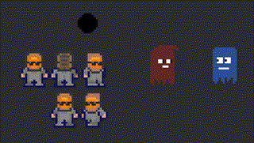

# Bevy Aseprite Ultra

[](./LICENSE)
[](https://crates.io/crates/bevy_aseprite_ultra)

The ultimate bevy aseprite plugin. This plugin allows you to import aseprite files into bevy, with 100% unbreakable
hot reloading. You can also import static sprites from an aseprite atlas type file using slices with functional pivot offsets!

| Bevy Version | Plugin Version |
| -----------: | -------------: |
|         0.19 |          0.9.0 |
|         0.18 |          0.8.1 |
|         0.17 |          0.7.0 |
|         0.16 |          0.6.1 |
|         0.15 |          0.4.1 |
|         0.14 |          0.2.4 |
|         0.13 |          0.1.0 |

## Supported aseprite features

- Animations
- Tags
- Frame duration, repeat, and animation direction
- Layer visibility
- Blend modes
- Static slices and pivot offsets

## Features in bevy

- Hot reload anything, anytime, anywhere!
- Full control over animations using Components.
- One shot animations and events when they finish.
- Static sprites with slices. Use aseprite for all your icon and UI needs!
- Render to custom material and write shaders ontop.
- Asset processor which converts the aseprite file to a custom format.

(hot reloading requires the `file_watcher` feature in bevy)

## Examples

```bash
cargo run --example slices
cargo run --example animations
cargo run --example ui
cargo run --example asset_processing --features asset_processing
cargo run --example 3d --features 3d
```



<small> character animation by [Benjamin](https://github.com/headcr4sh) </small>

---

```rust
use bevy::prelude::*;
use bevy_aseprite_ultra::prelude::*;

...

// Load an animation from an aseprite file
fn spawn_demo_animation(mut cmd : Commands, server : Res<Assetserver>){
    cmd.spawn((
        AseAnimation {
            aseprite: server.load("player.aseprite"),
            animation: Animation::tag("walk-right")
                .with_repeat(AnimationRepeat::Count(1))
                .with_speed(2.)
                // Aseprite provides a repeat config per tag, which is beeing ignored on purpose.
                .with_repeat(AnimationRepeat::Count(42))
                // The direction is provided by the asperite config for the tag, but can be overwritten.
                .with_direction(AnimationDirection::PingPong)
                // you can also chain finite animations, loop animations will never finish
                .with_then("walk-left", AnimationRepeat::Count(4))
                .with_then("walk-up", AnimationRepeat::Loop),
        },
        // The Render target. There are default impls for Sprite, Ui and 3D.
        // You may also define your own. Checkout the examples.
        Sprite {
            flip_x: true,
            ..default()
        },
    ));
}

// Load a static slice from an aseprite file
// create for any static atlas with marked regions aka slices.
fn spawn_demo_static_slice(mut cmd : Commands, server : Res<Assetserver>){
    cmd.spawn((
        AseSlice {
            name: "ghost_red".into(),
            aseprite: server.load("ball.aseprite"),
        },
        Sprite::default(),
    ));
}

// animation events
// this is useful for one shot animations like explosions
fn despawn_on_finish(mut events: EventReader<AnimationEvents>, mut cmd : Commands){
    for event in events.read() {
        match event {
            AnimationEvents::Finished(entity) => cmd.entity(*entity).despawn_recursive(),
            // you can also listen for loop cycle repeats
            AnimationEvents::LoopCycleFinished(_entity) => (),
        };
    }
}
```

## Bevy Ui

Nothing to changes. Just add the animation/slice together with an `ImageNode`.

```rust
// animations in bevy ui
cmd.spawn((
        Button,
        ImageNode::default(), // RenderTarget
        AseAnimation {
            aseprite: server.load("player.aseprite"),
            animation: Animation::tag("walk-right"),
        },
));

// slices in bevy ui
cmd.spawn((
        Node {
            width: Val::Px(100.),
            height: Val::Px(100.),
            border: UiRect::all(Val::Px(5.)),
            ..default()
        },
        ImageNode::default(), // RenderTarget
        AseSlice {
            name: "ghost_red".into(),
            aseprite: server.load("ghost_slices.aseprite"),
        },
));
```

## Enable Asset Processing

Simply enable asset processing in your `AssetPlugin` like so:

```rust
App::new()
    .add_plugins(DefaultPlugins.set(AssetPlugin {
        mode: AssetMode::Processed,
        ..Default::default(),
    }))
    .run();
```

Then run with the feature `asset_processing` enabled, e.g.:

```
cargo run --features asset_processing
```

Then load your aseprite files in code as usual!
